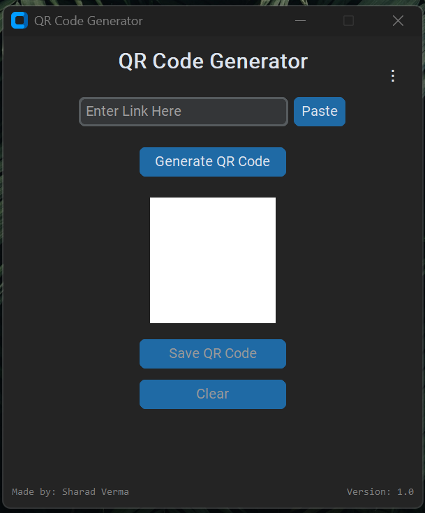

<p float="left">
  
  
</p>

# QR Code Generator App

This Python-based app allows users to generate QR codes from any URL or text, using a user-friendly graphical interface built with **Tkinter** and **CustomTkinter**. It also offers features such as saving QR codes, clearing the screen, and switching between light and dark themes.

## Features:
- **Generate QR Code**: Enter a link or text to generate a QR code.
- **Paste**: Paste a copied link directly into the input field.
- **Save QR Code**: Save the generated QR code as a PNG image.
- **Clear**: Clear the screen and reset the app.
- **Dark/Light Mode**: Toggle between dark and light themes.
- **Version**: 1.0 (2024)

## Requirements:
To run this app, you'll need the following libraries:

- `qrcode[pil]`: To generate QR codes.
- `Pillow`: For image manipulation.
- `customtkinter`: For a modern UI.
- `tk`: Standard library for GUI in Python.

You can install the required libraries using the following command:

```bash
pip install -r requirements.txt
